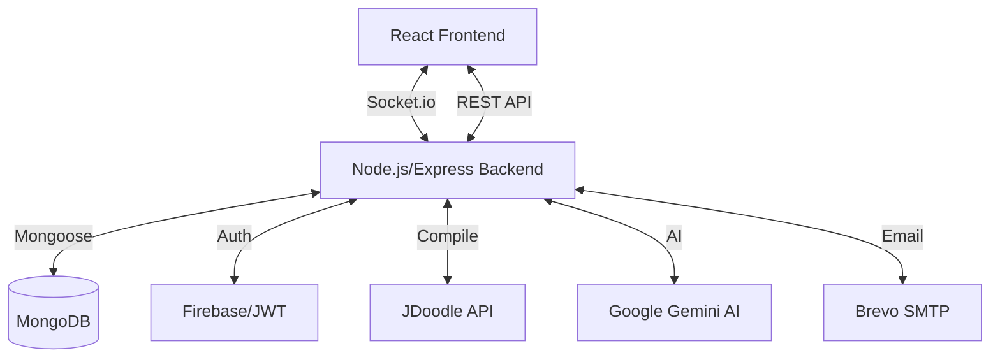

# 🚀 CodeXAlive — The Ultimate Collaborative Coding & Social Hub

[](https://reactjs.org/)
[](https://nodejs.org/)
[](https://www.mongodb.com/)
[](https://socket.io/)
[](https://opensource.org/licenses/MIT)

**CodeXAlive** is a high-performance, feature-complete collaborative IDE designed for the modern developer. It combines a professional-grade workspace with a rich social ecosystem, enabling real-time pair programming, seamless project management, and developer networking.

---

## 📖 Table of Contents

- [✨ Key Features](#-key-features)
- [🏗️ System Architecture](#️-system-architecture)
- [🛠️ Technology Stack](#️-technology-stack)
- [📁 Project Structure](#-project-structure)
- [🧩 Components & Functionality](#-components--functionality)
- [🚀 Getting Started](#-getting-started)
- [💡 Use Cases](#-use-cases)
- [🛡️ Security & Performance](#️-security--performance)
- [🤝 Contributing](#-contributing)

---

## ✨ Key Features

### 💻 The Ultimate Workspace
- **Real-Time Synchronization**: Instant code updates across all participants powered by Socket.io.
- **Live Cursor Tracking**: Visual presence with color-coded cursors and labels.
- **Multi-File Explorer**: VS Code-inspired recursive file tree for complex project structures.
- **AI-Powered Assistance**: Integrated Gemini AI for debugging, refactoring, and code generation.
- **In-Browser Execution**: Compile and run code in 20+ languages using JDoodle integration.
- **Advanced Editor Features**: Prettier formatting, syntax highlighting, and auto-complete.
- **Version Control**: Built-in version history to track and restore code snapshots.
- **Export Anywhere**: Download your entire project as a ZIP archive with one click.

### 👥 Collaboration & Governance
- **Waiting Rooms**: Secure workspace entry with owner-controlled access.
- **Role-Based Access (RBAC)**: Manage permissions with Editor and Viewer roles in real-time.
- **Admin Suite**: Kick, ban, or transfer project ownership seamlessly.
- **Unified Chat**: Persistent room chat with private Direct Messaging (DM) support.
- **Meeting Scheduler**: Integrated tool to coordinate and manage team meetings.

### 🌐 Social Developer Hub
- **Contribution Heatmap**: GitHub-style 365-day activity tracking.
- **Developer Profiles**: Showcase public projects, collaboration stats, and activity feeds.
- **Follower Network**: Build your network with real-time follow/unfollow notifications.
- **Global Search**: Discover developers by username, email, or unique ID.

---

## 🏗️ System Architecture



---

## 🛠️ Technology Stack

| Layer | Technologies |
| :--- | :--- |
| **Frontend** | React 18, Vite, CodeMirror 6, Socket.io-client, Axios, Vanilla CSS |
| **Backend** | Node.js, Express, Socket.io 4, MongoDB (Mongoose), Archiver |
| **Auth** | JWT (Stateless), Firebase Admin SDK (Social Auth), Bcrypt.js |
| **AI/Integrations** | Google Gemini AI, JDoodle Compiler API, Brevo (Email), GitHub API |
| **DevOps** | Docker, Docker Compose, Nginx, Render (Backend), Vercel (Frontend) |

---

## 📁 Project Structure

```text
CodeXAlive/
├── client/                  # React + Vite Frontend
│   ├── src/
│   │   ├── components/      # UI, Layout, and Workspace components (Editor, Chat, AI)
│   │   ├── pages/           # Application views (Dashboard, Editor, Profile, Login)
│   │   ├── hooks/           # Custom React hooks (Auth, Socket, Theme, FileTree)
│   │   ├── services/        # API communication layers (Axios interceptors)
│   │   ├── utils/           # Helper functions, constants, and Actions.js
│   │   └── index.css        # Global styles and design tokens
│   └── vite.config.js       # Build and Proxy configuration
│
└── server/                  # Node.js + Express Backend
    ├── controllers/         # Business logic (Project, File, Auth, AI, Social)
    ├── models/              # MongoDB (Mongoose) schemas (User, Project, File, Message)
    ├── routes/              # Express API endpoints
    ├── sockets/             # Socket.io events and room state management
    │   ├── handlers/        # Specific event handlers (Code, Room, Chat, Permissions)
    │   └── roomState.js     # In-memory ephemeral store for cursors and active users
    ├── middleware/          # Auth, Rate-limiting, and Security headers
    ├── utils/               # Backend helpers (Email, AI, Compiler, Logger)
    └── index.js             # Server entry point and Socket.io bootstrap
```

---

## 🧩 Components & Functionality

### Frontend Core Components
- **`EditorPage.jsx`**: The main orchestration component for the collaborative workspace.
- **`Editor.jsx`**: CodeMirror implementation with live cursor and selection tracking.
- **`AIPanel.jsx`**: Interface for interacting with the Gemini AI assistant.
- **`FileExplorer.jsx`**: Recursive file tree management with CRUD operations and context menus.
- **`ChatPanel.jsx`**: Real-time communication hub for room participants with DM support.
- **`ShareModal.jsx`**: Project invitation and permission management system.
- **`Dashboard.jsx`**: Centralized hub for user projects and collaboration stats.
- **`PublicProfile.jsx`**: Social hub displaying activity heatmaps and networking stats.

### Backend Logic
- **`socketHandler.js`**: Orchestrates all real-time events and handshakes.
- **`roomState.js`**: Manages ephemeral room data (cursors, active members) for performance.
- **`projectController.js`**: Handles persistence and management of collaborative projects.
- **`downloadController.js`**: Manages the streaming of project files into a ZIP archive.

---

## 🚀 Getting Started

### Prerequisites
- Node.js (v18 or higher)
- MongoDB Atlas or Local Instance
- Firebase Project (for Social Auth)
- API Keys: JDoodle, Google Gemini, Brevo (Optional)

### 1. Clone & Install
```bash
git clone https://github.com/Riteshmaurya07/Code_X_Live.git
cd Code_X_Live
```

### 2. Configure Environment
**Server (`/server/.env`):**
```env
PORT=5000
MONGODB_URI=your_mongo_url
JWT_SECRET=your_jwt_secret
JDOODLE_CLIENT_ID=your_id
JDOODLE_CLIENT_SECRET=your_secret
GEMINI_API_KEY=your_key
SMTP_API_KEY=your_brevo_key
CLIENT_URL=http://localhost:5173
```

**Client (`/client/.env`):**
```env
VITE_BACKEND_URL=http://localhost:5000
VITE_FIREBASE_API_KEY=...
# Add other Firebase config vars
```

### 3. Run Locally
**Start Backend:**
```bash
cd server && npm install && npm run dev
```

**Start Frontend:**
```bash
cd client && npm install && npm run dev
```

---

## 💡 Use Cases

- **Pair Programming**: Collaborate on complex features with real-time feedback and shared cursors.
- **Technical Interviews**: Conduct coding assessments in a live, interactive environment with AI debugging.
- **Education & Mentorship**: Teach coding concepts by sharing a live workspace and conducting meetings.
- **Open Source Collaboration**: Rapidly prototype and brainstorm with global teams using integrated chat.
- **Project Showcasing**: Build a professional developer profile and highlight your contributions via heatmaps.

---

## 🛡️ Security & Performance

- **Rate Limiting**: Protection against brute-force and DDoS attacks on expensive endpoints.
- **Security Headers**: Production-hardened with `helmet.js`.
- **Stateless Auth**: Secure JWT-based authentication with social fallbacks via Firebase.
- **Compression**: Gzip-compressed responses for faster data transfer.
- **Validation**: Strict environment and Mongoose schema validation at startup.

---

## 🤝 Contributing

Contributions are what make the open source community such an amazing place to learn, inspire, and create. Any contributions you make are **greatly appreciated**.

1. Fork the Project
2. Create your Feature Branch (`git checkout -b feature/AmazingFeature`)
3. Commit your Changes (`git commit -m 'Add some AmazingFeature'`)
4. Push to the Branch (`git push origin feature/AmazingFeature`)
5. Open a Pull Request

---

## 📄 License

Distributed under the MIT License. See `LICENSE` for more information.
